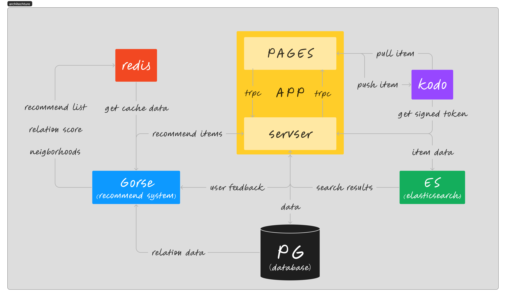

# volo

### Next.js

**角色**: 前端框架和服务端渲染引擎

Next.js 是构建 React 应用程序的主力框架，提供了丰富的前端功能和后端集成。它的服务端渲染能力特别强大，能够大幅提升应用的初次加载性能，同时对搜索引擎优化（SEO）非常友好。

- **客户端渲染**: 利用 React 来构建动态且交互式的用户界面，可以充分利用 React 的生态系统和组件库。
- **服务端渲染**: Next.js 在服务端动态生成 HTML，加快首次内容呈现速度，并改善核心 Web 痛点。

### NextAuth.js

**角色**: 认证和授权解决方案

NextAuth.js 为 Next.js 应用提供了一个简洁且全面的认证解决方案。它专门针对无服务和微服务架构设计，简化了会话创建和维护。

- **会话管理**: 高效地处理用户的登录会话和令牌刷新，确保用户状态的持续性和安全性。
- **适配器**: 提供与多种数据库的接口，能够灵活地在不同的数据库环境中存储和管理用户数据。

### tRPC

**角色**: 端点之间的类型安全通信桥梁

tRPC 在类型安全的前提下提供了端到端的逻辑关系，确保在编译时捕获可能的错误，从而在构建 API 时提供自信。

- **类型安全**: 在前后端间传递数据时，保持严格的类型一致性，避免了类型错误。
- **自文档化**: 由于前后端共享同一套类型定义，因此不再需要单独的 API 文档来保证双方协议的一致性。

### Prisma

**角色**: 数据库抽象层和类型安全的 ORM

Prisma 以其声明性和直观的模型定义以及强大的查询能力，为现代应用程序提供了一个可扩展的数据库访问层。

- **模型定义**: 使用 Prisma Schema 语言，可以清晰地描述数据模型，并以此为基础自动生成数据库迁移。
- **查询能力**: Prisma Client 提供了丰富而直观的 API 用于执行复杂的数据库操作，同时确保操作的类型安全性。
- **智能迁移**: Prisma Migrate 功能帮助开发者安全地变更数据库结构，同时保持数据完整性。

整合这些技术，应用程序不仅在用户体验上提供了快速响应的界面，而且在开发过程中也实现了高度的效率和准确性。通过 Next.js，可以构建一个充满活力的前端体验，而 NextAuth.js 则保证了用户的认证流程既流畅又安全。在此基础上，tRPC 的类型安全机制确保了前后端的通信无缝且准确，最后由 Prisma 的现代 ORM 层来保障数据的强类型和高效操作。这样的架构模式不仅提升了开发的速度和质量，还减少了运行时错误的可能性，使得整个应用的维护更加可靠和容易。

## 外部依赖全览

## 成员分工

| 成员 | 分工 |
|:---:|---|
|  **ComfyFluffy** | 项目管理和代码审查 |
|  **AY7295** | - 接入 **NextAuth** 认证 - 实现部分 **tRPC** 接口 - 设计数据库结构 - 集成 **Gorse** 和 **Elasticsearch** API - 配置 **Docker Compose** 部署 |
|  **Cierra-Runis** | 前端界面设计与实现 |
